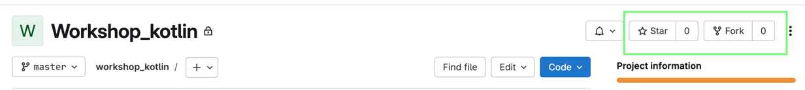

# KotlinWorkshop
Is a set of test to learn kotlin programming

## How to run the tests

1. Click on the start of the repository ⭐️
2. Fork the repository
## 

2. Clone the repository in your local
```bash
mkdir my-new-directory
cd my-new-directory
git clone <repo URL> .
```

3. Open the project in IntelliJ IDEA
4. Solve the problems in /main/kotlin classes
5. Mark in the Readme.md file the problems that you have solved
6. Run the tests
7. When your test pass, push your changes to your repository
8. Solve all problems

- [ ] Agility
- [ ] Basic
- [ ] Conversion
- [ ] Geometric
- [ ] Pokemon
- [ ] Zodiac
- [ ] Chains

> [!important]
> In case of updates by your teacher, you should to add a new remote
> Choose the correct repo based in your group (Day/Night)

> ```bash
>    git remote add original https://gitlab.com/ucatolic/2025_1/android_d/sigmotoa/workshop_kotlin
>    git remote add original https://gitlab.com/ucatolic/2025_1/android_n/sigmotoa/workshop_kotlin
>    git pull original master
```